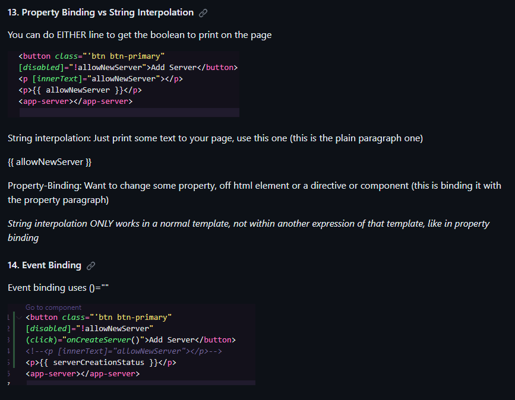

### Exercise 1: Introduction and Setup

1. Modify the default content of the app.component.html to display "Welcome to Angular Basics!".

2. Serve the application locally and view the result in the browser.

### Exercise 2: Profile Component

1. Create a new component named profile.

2. In the profile component, define properties for name (string) and age (number).

3. Display these properties in the component's template.
Include the profile component in the main app.component.html.

### Exercise 3: Counter Component & Data Binding

1. Create a new component named counter.

2. Implement a simple counter that increases and decreases a number value.

3. Use property binding to display the current value and event binding for the increment and decrement actions.

*Translates to: Put the current numerical value to list from the counter HTML to the main HTML. And for the Increment buttons use ()=""*

**Property Binding: Property binding moves a value in one direction, from a component's property into a target element property.**

**Event Binding: Event binding lets you listen for and respond to user actions such as keystrokes, mouse movements, clicks, and touches. Event binding uses ()=""**

4. Incorporate the counter component in the main app.component.html.

## References:

    https://www.geeksforgeeks.org/how-to-make-incremental-and-decremental-counter-using-html-css-and-javascript/